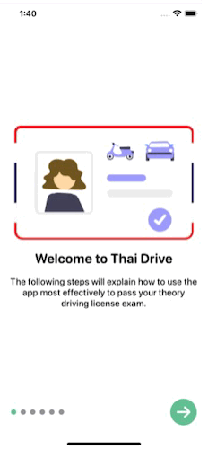

# SwiftUI onboarding with confetti animation and RevenueCat paywall
&nbsp;&nbsp;&nbsp;&nbsp;&nbsp;&nbsp;

## About
Simple swipeable onboarding view for new users of your app.

## 🌄 Example video for my [Thai Drive App](https://apps.apple.com/us/app/id6446759635)



## 🧭 Navigation

- [🎉 Confetti Animation](#-confetti-animation)
- [📲 Onboarding](#onboarding-implementation)
- [💰 PayWall](#revenuecat-paywall-implementation)

  
## 🎉 Confetti Animation
For confetti animation I use [ConfettiSwiftUI](https://github.com/simibac/ConfettiSwiftUI). It's available as a [Swift Package](https://swift.org/package-manager/). 
To integrate `ConfettiSwiftUI` into your Xcode project using Xcode, specify it in `File > Swift Packages > Add Package Dependency...`:

```ogdl
https://github.com/simibac/ConfettiSwiftUI.git, :branch="master"
```
---

## 🔨Support 

If you like the project, don't forget to `put star 🌟`.

## 🛠 Usage
### Onboarding implementation 
Create a Data Model.
```swift
import Foundation

enum DataModel {
    case step(StepView)
    case paywall(PayWallView)
}

struct StepView {
    var image: String
    var heading: String
    var text: String
}

extension DataModel {
    static var data: [DataModel] = [
         // each step of the array will add a new screen
        .step(StepView(image: "Onboarding1", heading: "Welcome to the App", text: "The following steps will explain ho to use the app most effectively.")),
        .step(StepView(image: "Onboarding2", heading: "Step 2", text: "Short description about Step 2")),
        .step(StepView(image: "OnBoarding3", heading: "Step 3", text: "Short description about Step 3")),
        .step(StepView(image: "Onboarding4", heading: "Step 4", text: "Short description about Step 4")),
        .paywall(PayWallView()),
        .step(StepView(image: "Onboarding5", heading: "Step 5", text: "Short description about Step 6")),
    ]
}
```
Create a new SwiftUI view for Step View:
```swift
import SwiftUI
import ConfettiSwiftUI


struct OnboardingStepView: View {
    var data: DataModel
    
    @State private var showConfetti = false
    
    @State private var counter: Int = 0

    
    var body: some View {
        switch data {
        case .step(let step):
            
            VStack {
                Image(step.image)
                        .resizable()
                        .scaledToFit()
                        .padding(.bottom, 10)
                        .padding(.horizontal, 10)

                Text(step.heading)
                    .font(.system(size: 25, design: .rounded))
                    .fontWeight(.bold)
                    .padding(.bottom, 10)
                
                Text(step.text)
                    .font(.system(size: 17, design: .rounded))
                    .fontWeight(.medium)
                    .multilineTextAlignment(.center)
                    .padding(.bottom, 60)
            }
            .padding()
            .contentShape(Rectangle())
                
        case .paywall(let paywall):
            paywall
        }
    }
}


struct OnboardingStepView_Previews: PreviewProvider {
    static var data = DataModel.data[0]
    static var previews: some View {
        OnboardingStepView(data: data)
    }
}
```
Create another SwiftUI View for Onboarding Content View. You also can use your main ContentView.
```swift
import SwiftUI
import ConfettiSwiftUI

struct OnboardingContentView: View {
    @State private var onboardingDone = false
    @Environment(\.presentationMode) var presentationMode

    @State private var showConfetti = false
    @State private var counter: Int = 0

    var data = DataModel.data
    
    var body: some View {
        Group {
            if !onboardingDone {
                OnboardingViewPure(data: data, doneFunction: {
                    self.onboardingDone = true
                    self.presentationMode.wrappedValue.dismiss()
                })
            } else {
                Text("Hello world")
            }
        } .onAppear {
            showConfetti = true
            counter += 1
            
        }
        .confettiCannon(counter: $counter, repetitions: 5, repetitionInterval: 2.0)
    }
}

struct OnboardingContentView_Previews: PreviewProvider {
    static var previews: some View {
        OnboardingContentView()
    }
}
```
Create one more SwiftUI for View Pure (doted slides):
```swift
import SwiftUI
import ConfettiSwiftUI
import StoreKit

struct OnboardingViewPure: View {
    var data: [DataModel]
    var doneFunction: () -> ()

    @State var slideGesture: CGSize = CGSize.zero
    @State var curSlideIndex = 0
    var distance: CGFloat = UIScreen.main.bounds.size.width

    func nextButton() {
        if self.curSlideIndex == self.data.count - 1 {
            
            requestAppReview()
            doneFunction()
            return
        }

        if self.curSlideIndex < self.data.count - 1 {
            withAnimation {
                self.curSlideIndex += 1
            }
        }
    }

    var body: some View {
        ZStack {
            Color(.systemBackground).edgesIgnoringSafeArea(.all)

            ZStack(alignment: .center) {
                ForEach(0..<data.count) { i in
                    OnboardingStepView(data: self.data[i])
                        .offset(x: CGFloat(i) * self.distance)
                        .offset(x: self.slideGesture.width - CGFloat(self.curSlideIndex) * self.distance)
                        .animation(.spring())
                        .gesture(DragGesture().onChanged{ value in
                            self.slideGesture = value.translation
                        }
                        .onEnded{ value in
                            if self.slideGesture.width < -50 {
                                if self.curSlideIndex < self.data.count - 1 {
                                    withAnimation {
                                        self.curSlideIndex += 1
                                    }
                                }
                            }
                            if self.slideGesture.width > 50 {
                                if self.curSlideIndex > 0 {
                                    withAnimation {
                                        self.curSlideIndex -= 1
                                    }
                                }
                            }
                            self.slideGesture = .zero
                        })
                }
            }

            VStack {
                Spacer()
                HStack {
                    self.progressView()
                    Spacer()
                    Button(action: nextButton) {
                        self.arrowView()
                    }
                }
            }
            .padding(20)
        }
    }

    func arrowView() -> some View {
        Group {
            if self.curSlideIndex == self.data.count - 1 {
                HStack {
                    Button(action: doneFunction) {
                        Text("Exit")
                            .font(.system(size: 27, weight: .medium, design: .rounded))
                            .foregroundColor(Color(.systemBackground))
                    }
                }
                .frame(width: 120, height: 50)
                .background(Color(red: 95/255, green: 186/255, blue: 142/255))
                .cornerRadius(25)
            } else {
                Image(systemName: "arrow.right.circle.fill")
                    .resizable()
                    .foregroundColor(Color(red: 95/255, green: 186/255, blue: 142/255))
                    .scaledToFit()
                    .frame(width: 50)
            }
        }
    }
    
    func requestAppReview() {
        if #available(iOS 14.0, *) {
            if let scene = UIApplication.shared.connectedScenes.first as? UIWindowScene {
                SKStoreReviewController.requestReview(in: scene)
            }
        } else {
            SKStoreReviewController.requestReview()
        }
    }

    func progressView() -> some View {
        HStack {
            ForEach(0..<data.count) { i in
                Circle()
                    .scaledToFit()
                    .frame(width: 10)
                    .foregroundColor(self.curSlideIndex >= i ? Color(red: 95/255, green: 186/255, blue: 142/255) : Color(.systemGray))
            }
        }
    }
}

struct OnboardingViewPure_Previews: PreviewProvider {
    static let sample = DataModel.data
    static var previews: some View {
        OnboardingViewPure(data: sample, doneFunction: { print("done") })
    }
}
```
I also added Request for App Review after the user has completed onboarding. It might help to get more ratings. 
---
### RevenueCat Paywall implementation
#### For this project I use RevenueCat SDK for In-app purchases.
Create an IAPManager class. Don't forget to add your Public app-specific API key, you can find it on RevenueCat project settings -> API Keys. If you use another SDK for In-App purchases, let me know. I'm still thinking what to use for my apps.
```swift
import SwiftUI
import RevenueCat

class IAPManager: ObservableObject {
    static let shared = IAPManager()

    @Published var packages: [Package] = []
    @Published var inPaymentProgress = false

    init() {
        Purchases.shared.getOfferings { (offerings, _) in
            if let packages = offerings?.current?.availablePackages {
                self.packages = packages
            }
        }
    }
    
    func purchase(product: Package, completion: @escaping (Bool) -> Void) {
          guard !inPaymentProgress else { return }
          inPaymentProgress = true
          Purchases.shared.purchase(package: product) { (_, purchaserInfo, _, error) in
              self.inPaymentProgress = false
              completion(error == nil)
          }
      }
}


// TODO: - add your RevenueCat API Key and entitlementID
struct Constants {
    //TODO: - Add your API Key
    static let apiKey = "Your_API_Key"
  // Example entitlementID
    static let entitlementID = "Ad-free access"
}
```
Create a SwiftUI view for Paywall:
```swift
import SwiftUI
import RevenueCat

struct PayWallView: View {
        
    @Environment(\.presentationMode) var presentationMode
    @StateObject var subscriptionManager = IAPManager()
    @State private var isAdFree = UserDefaults.standard.bool(forKey: "isAdFree")

    // - State for displaying an overlay view
        @State private(set) var isPurchasing: Bool = false
        @State private var purchaseCompleted: Bool = false
        @State private var purchaseError: Bool = false

    //MARK: Body
    var body: some View {
        ScrollView(showsIndicators: false) {
            VStack {
                Spacer()
                VStack {
                    HStack {
                        // Ad-free mode
                        Text("Ad-free mode")
                            .font(.system(size: 34, weight: .heavy, design: .rounded))
                            .padding(.leading, 10)
                            .foregroundColor(Color(red: 153/255, green: 151/255, blue: 246/255))
                        Spacer()
                    } //:HStack
                        .padding(.top, 10)
                    
                    VStack(alignment: .leading) {
                        Text("I'm an independent developer creating products that I'd like to be useful to you")
                            .font(.system(size: 17, weight: .medium, design: .rounded))
                            .multilineTextAlignment(.center)
                    } //:VStack
                    
                    .padding(.top, 10)
                    
                    VStack(alignment: .center) {
                        //TODO: - Add your image
                        Image("AddYourImage")
                            .resizable()
                            .scaledToFit()
                    }
                    
                    ForEach(subscriptionManager.packages, id: \.identifier) { product in
                                        Button(action: {
                                            subscriptionManager.purchase(product: product) { success in
                                                if success {
                                                    purchaseCompleted = true
                                                    purchaseError = false
                                                    isAdFree = true
                                                    UserDefaults.standard.set(isAdFree, forKey: "isAdFree")
                                                } else {
                                                    purchaseCompleted = false
                                                    purchaseError = true
                                                    isAdFree = false
                                                    UserDefaults.standard.set(isAdFree, forKey: "isAdFree")
                                                }
                                            }
                                        }) {
                                ZStack {
                                    Rectangle()
                                        .fill(Color(red: 153/255, green: 151/255, blue: 246/255))
                                        .frame(height: 55)
                                        .cornerRadius(10)
                                    IAPRow(product: product)
                                    
                                } //:ZStack
                            }
                        }
             
                    .padding(.vertical)  
                    
                    HStack {
                        Button(action: {
                            //TODO: - Add your Privacy Policy
                            if let url = URL(string: "https://apple.com/") {
                                UIApplication.shared.open(url)
                            }
                        }) {
                            Text("Privacy Policy")
                                .font(.subheadline)
                                .foregroundColor(.secondary)
                        } .padding(.horizontal, 20)
                        Spacer()
                        Button(action: {
                            if let url = URL(string: "https://www.apple.com/legal/internet-services/itunes/dev/stdeula/") {
                                UIApplication.shared.open(url)
                            }
                        }) {
                            Text("Terms of Use")
                                .font(.subheadline)
                                .foregroundColor(.secondary)
                        } .padding(.horizontal, 20)
                    }
                    .padding(.bottom, 8)                 
                    Button(action: {
                        Purchases.shared.restorePurchases(completion: nil)
                    }) {
                        //Restore purchases
                        Text("Restore Purchases")
                            .font(.headline)
                            .foregroundColor(.secondary)
                    }
                    .padding(.bottom, 16)
                    Spacer()
                } //:VStack
               
                .padding()
            } //:VStack
        }
        
        // Alerts for purchases
        .alert(isPresented: $purchaseCompleted) {
                  Alert(
                      title: Text("You're all set!"),
                      message: Text("Thank you for your purchase."),
                      dismissButton: .default(Text("OK"))
                  )
              }
              .alert(isPresented: $purchaseError) {
                  Alert(
                      title: Text("Your purchase has not been complete."),
                      message: Text("Please, try again."),
                      dismissButton: .default(Text("OK"))
                  )
              }
    }
}

struct IAPRow: View {
    var product: Package
    var body: some View {
        HStack {
            Text(product.storeProduct.localizedDescription)
            Spacer()
            Text(product.localizedPriceString)
        } //:HStack
        .font(.system(size: 14, weight: .bold, design: .rounded))
        .foregroundColor(.white)
        .padding(20)
    }
}

struct PayWallView_Previews: PreviewProvider {
    static var previews: some View {
        PayWallView()
            .environmentObject(IAPManager())
    }
}
```
Create Purchases Delegate Handler
```swift
    import Foundation
import RevenueCat

class PurchasesDelegateHandler: NSObject, ObservableObject {
    static let shared = PurchasesDelegateHandler()
}

extension PurchasesDelegateHandler: PurchasesDelegate {
    /**
     Whenever the `shared` instance of Purchases updates the CustomerInfo cache, this method will be called.
    
     - Note: CustomerInfo is not pushed to each Purchases client, it has to be fetched.
     This delegate method is only called when the SDK updates its cache after an app launch, purchase, restore, or fetch.
     You still need to call `Purchases.shared.customerInfo` to fetch CustomerInfo regularly.
     */
    func purchases(_ purchases: Purchases, receivedUpdated customerInfo: CustomerInfo) {
        /// - Update our published customerInfo object
    }
    /**
     - Note: this can be tested by opening a link like:
     itms-services://?action=purchaseIntent&bundleId=<BUNDLE_ID>&productIdentifier=<SKPRODUCT_ID>
     */
    func purchases(_ purchases: Purchases,
                   readyForPromotedProduct product: StoreProduct,
                   purchase startPurchase: @escaping StartPurchaseBlock) {
        startPurchase { (transaction, info, error, cancelled) in
            if let info = info, error == nil, !cancelled {
            }
        }
    }
}
```
Add RenevueCat purchases initialization in YourApp struct
```swift
import SwiftUI
import RevenueCat

@main
struct SwiftUI_Onboarding_Animation_PayWall_RevenueCatApp: App {
    init() {
           Purchases.logLevel = .debug
           Purchases.configure(with: Configuration.Builder(withAPIKey: Constants.apiKey).with(usesStoreKit2IfAvailable: true).build())
           Purchases.shared.delegate = PurchasesDelegateHandler.shared
       }
  var body: some Scene {
        WindowGroup {
            ContentView()
        }
    }
}
```
⚠️ If your app based on Storyboard, add it to AppDelegate:
```swift
func application(_ application: UIApplication, didFinishLaunchingWithOptions launchOptions: [UIApplication.LaunchOptionsKey: Any]?) -> Bool {
        Purchases.logLevel = .debug
        Purchases.configure(with: Configuration.Builder(withAPIKey: Constants.apiKey).with(usesStoreKit2IfAvailable: true).build())
        Purchases.shared.delegate = self
        return true
    }
```
And add extension to AppDelegate instead of PurchasesDelegateHandler file PayWall folder
```swift
extension AppDelegate: PurchasesDelegate {
    func purchases(_ purchases: Purchases, receivedUpdated customerInfo: CustomerInfo) {
        print("Modified")
    }
}
```
If you have any suggestions or improvements of any kind let me know. Peace.

## ✍️ Author

Arty Peace

- [Jump Up](#-overview)
